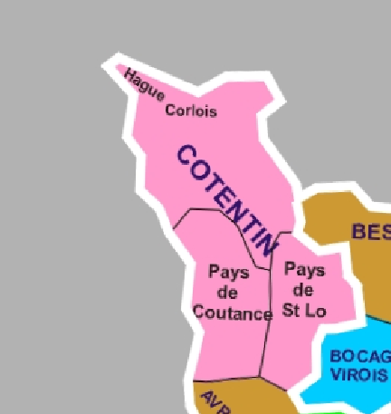

# Digitalisation de la carte des "régions naturelles ou pays traditionnels"

L'objectif est d'avoir une digitalisation de la carte des "regions naturelles ou pays traditionnel". 

Cette carte documente le [wiki de ces regions](https://fr.wikipedia.org/wiki/Liste_des_r%C3%A9gions_naturelles_de_France). Elle a été conçue par **Raymond Tarrit**. La création dans wikipedia est datée du 7 novembre 2019.

Elle est disponible en `./sources` au besoin.

## Géoréférencement 

Il a été fait sous QGIS (3.16). Les points d'amers (n = 30) sont dans `/data/Les_régions_naturelles_de_Frances.jpg.points`. La transformation utilisée, après plusieurs tests, est la *Thin plate spline* et un resampling linéaire. 

Le .tif en sortie est dans `./data/Les_regions_naturelles_de_France_modifiedv4.tif`.  

## Digitalisation 

Après des tests, pas folichons via Gimp, pas eu le choix de la faire à la mains. Elle a été faite principalement au 1:500 000 et 1:350 000. Deux types de digitalisation ont été faites : la première essaie de delimité des ces "pays" (`reg_nat.shp & co`) représntés par des polygones, la seconde localise par des points des "pays" sans limite apparente (`reg_nat_non_delim.geojson`). 

Les champs pour `reg_nat.shp` sont : 

* `Id` : un identifiant : pas encore renseigné (TODO une fois le fichier un peu stabilisé)
* `reg_nat` : Le nom de la région naturelle
* `ss_reg_nat` : une region qui semblait apartenir à une région plus englobante (cf. exemple plus bas)

Le reg_nat.shp est passé en geojson et est plus à jour. 

Les champs pour `reg_nat_non_delim.geojson` sont :

* `id` : vide pour le moment
* `reg_nat` : le nom sur la carte présent mais ne semblant être delimité (le point est au milieu du nom)

### Couacs et sources d'erreurs 

Les limites de ces régions sont materialisées en noir mais parfois recouvertes par une ligne blanche plus épaisse. Dans ce cas j'ai essayé de digitaliser au milieu ou de suivre la trajectoire d'une ligne noire. Dans certains cas il n'est pas evident de savoir si on a une region de delimitée (dont les limites sont recouvertes par le trait blanc) ou si on a une région positionnée mais sans limite. Il semble y avoir deux couleurs pour les noms des "régions naturelles": un noir et un noir grisé, le noir grisé me semblait apartenir à une categorie hierarchique plus importante (à tord ?) et j'ai utilisé ce critère en cas de doute. 

Je n'ai representé les regions, souvent nommées "pays", que quand ils avaient une delimitation (trait noir). La carte d'origine comporte plus de pays mais parfois sans delimitation (sans doute des regions localiables mais non delimitable). La solution a été de faire un fichier ponctuel avec le nom de ces regions associée au point (`reg_nat_non_delim.geojson`). 

### Avec un exemple :

Ici j'ai fait trois polygones. Ces trois poygones ont un champ `reg_nat` qui prend pour valeur `Cotentin`. Celui le plus au Nord à un champ `ss_reg_nat` vide (NULL dans QGIS mais pe l'expliciter par `NA` ou `-` -> TODO). Les deux autres vont avoir ce chanps avec `Pays de Coutance` à l'Ouest et  `Pays de St Lo` à l'Est.

On peut constater la présence de deux noms : *Hague* et *Corlois*. Ce sont des exemples de ce que j'ai nommé *region sans delimitation* (à defaut de mieux).

### Orthographe et capitalisations

J'ai pas eu l'impression qu'il y avait une logique dans la source (`Pays` vs `pays`) au niveau de la capitalisation (à tord?). Dans la mesure du possible je pense avoir capitalisé la première lettre du premier mot (`Pays` ou `Vallée`) et le nom propre suivant. Je peux être faché avec les accents (QWERTY) donc si j'en ai raté ou si j'ai fait une faute lors de la digitalisation il ne faut pas hesiter à le dire (issue github par exemple).

### Corse 

Pas faite mais il me semble que Thomas Gratier l'a faite (super !!!) et je la rajoute apres ce premier push.

## Avertissement !

Je ne suis absolument pas un specialiste de ce type de données. Dans le fil Twitter: Sylvain Genevois (@mirebol1) et Thomas Gratier (@ThomasG77) sont probablement plus compétents pour vous les contextualiser.

J'ai mis le resultat sur github par habitude mais on peut deplacer à n'importe quel autre endroit jugé plus simple / pratique. Je peux aussi donner les droits du dépot à qui en a envie. 

## TODO 

* [ ] un index 
* [ ] expliciter les valeurs manquantes
* [ ] rajouter la corse (probalement juste après ce push)
* [x] orthographe accent / capitalisations : être consistant (une première passe à été faite)
* [x] un fichier de point avec les régions non delimitées
* [ ] autres ?

